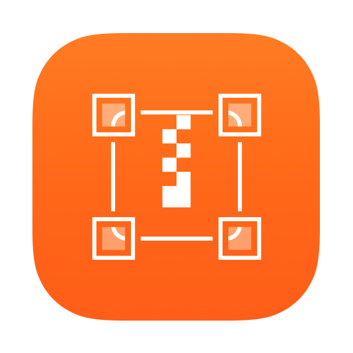
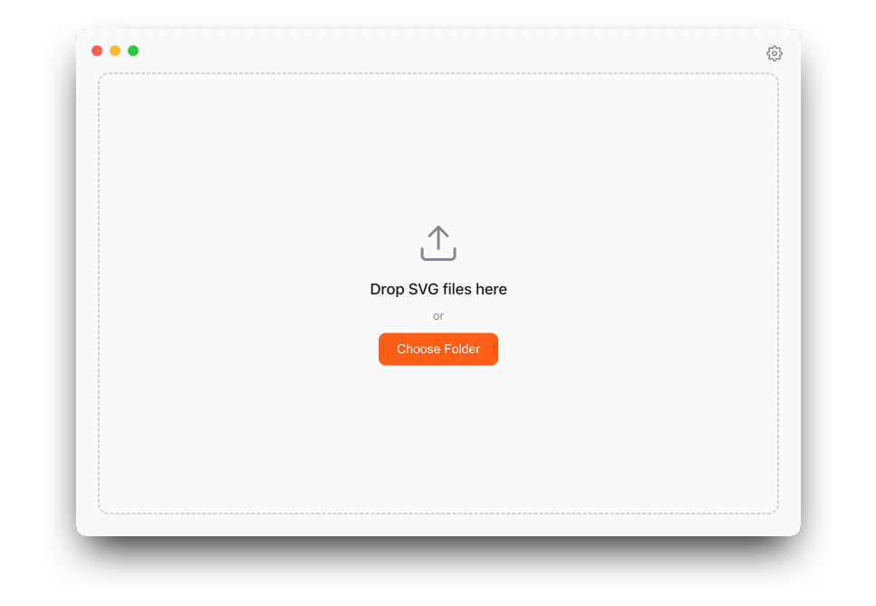
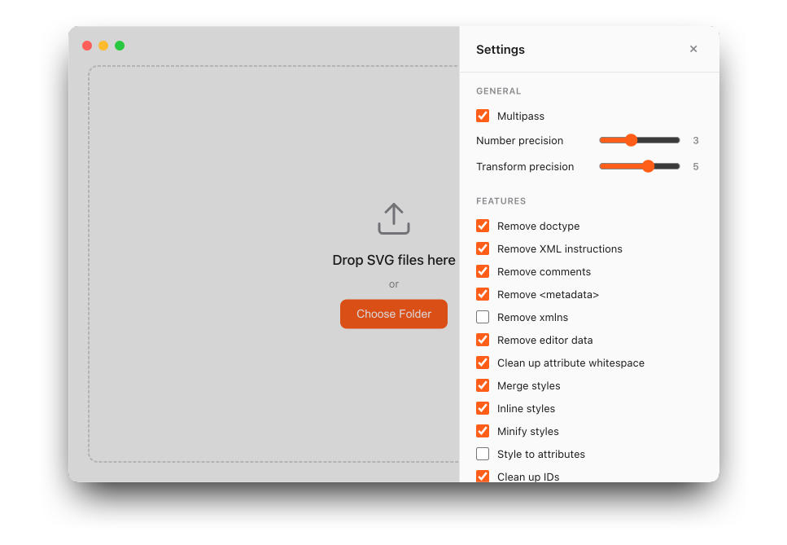

<p align="center">
  
</p>

<h1 align="center">MacSVGO</h1>

<p align="center">A minimal macOS desktop app for batch SVG optimization. Drop files or pick a folder — optimized SVGs are saved to a <code>/optimized</code> subfolder.</p>

<p align="center">
  
</p>

## How it works

- **Drag and drop** SVG files onto the window — you'll be prompted to choose a save location
- **Choose Folder** — scans the selected folder for `.svg` files and optimizes them in place (into a `/optimized` subfolder)
- Results show original vs optimized size and total savings percentage

## Settings

Click the gear icon to open the settings panel with full control over the optimization pipeline.

<p align="center">
  
</p>

**General:**
- Multipass — run plugins multiple times for better results
- Number precision (0-8) — decimal precision for numeric values
- Transform precision (0-8) — decimal precision for transform values

**Features (40 toggles):**
- Remove doctype, XML instructions, comments, metadata, editor data
- Clean up attribute whitespace, IDs, numeric values
- Merge/inline/minify styles, convert style to attributes
- Remove unknowns & defaults, unneeded group attrs, useless stroke & fill
- Remove hidden elements, empty text, empty attrs, empty containers
- Collapse useless groups, merge paths, round/rewrite paths and transforms
- Convert shapes to paths, ellipse to circle, colours
- Sort attrs and defs children
- Remove viewBox, title, desc, dimensions, style elements, scripts
- Remove unused defs and namespaces, out-of-bounds paths, deprecated attributes
- Replace duplicate elements with links, replace xlink with native SVG
- Convert one-stop gradients to solid colours

## Development

```
npm install
npm start
```

## Build

```
npm run dist
```

Produces `dist/MacSVGO-1.0.0-arm64.dmg`.

## Credits

Powered by [SVGO](https://github.com/svg/svgo). Settings panel inspired by [SVGOMG](https://github.com/jakearchibald/svgomg).

## Support

If MacSVGO saves you time, you can support its development on Ko-fi:

[](https://ko-fi.com/X0Z520U88Y)

